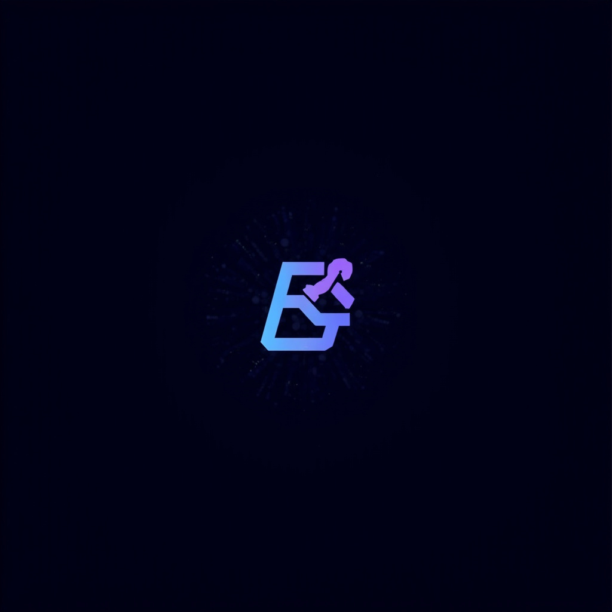

<p align="center">
  
</p>

<h1 align="center">AGI Super Team</h1>

<p align="center">
  <strong>737 AI 技能 · 12 位 C-Suite Agent · 29 个思维框架</strong><br/>
  几分钟内打造你的 AI 原生公司
</p>

<p align="center">
  <a href="https://github.com/openclaw/openclaw"></a>
  <a href="./LICENSE"></a>
  
  
  
</p>

<p align="center">
  <a href="./README.md">English</a> ·
  <a href="#quick-start">快速开始</a> ·
  <a href="./skills/README.md">全部技能</a> ·
  <a href="./agents/README.md">Agent</a> ·
  <a href="./cookbook/">教程</a> ·
  <a href="./workflows/">工作流</a>
</p>

---

## 💡 这是什么？

一个**即插即用的 AI 团队模板** — 基于 [OpenClaw](https://github.com/openclaw/openclaw) 部署完整的虚拟 C-Suite。每个 Agent 都有**精神导师**（Elon Musk、Jensen Huang、Warren Buffett...）塑造其性格和决策方式。

**727 技能 · 12 个 Agent · 29 个思维框架 · 30 个工作流。** 零配置 — 复制、定制、发布。

## 🏛️ 架构

```
你（创始人 / 董事长）
  └── 👑 CEO — 战略、协调、质量把关
        ├── ⚡ CTO — 代码、架构、调试
        ├── 🎨 CPO — 产品设计、用户体验、品牌
        ├── 📈 CQO — 量化交易、市场分析
        ├── 📣 CMO — 营销、SEO、增长
        ├── 💰 CFO — 财务、利润、成本优化
        ├── 📊 CDO — 数据采集、ETL、分析
        ├── ✍️ CCO — 内容创作、病毒式增长
        ├── ⚖️ CLO — 法律、合规、合同
        ├── 🔬 CRO — 深度研究、情报
        ├── 🤝 CSO — 销售、商务拓展
        ├── ⚙️ COO — 运营、监控、效率
        └── 💻 PE  — 全栈工程、DevOps
```

## 🚀 快速开始

```bash
# 1. 克隆仓库
git clone https://github.com/aAAaqwq/AGI-Super-Team.git
cd AGI-Super-Team

# 2. 部署 Agent（例如 CEO）
mkdir -p ~/.openclaw/workspace-main/skills/
cp -r skills/thinking-elon-musk/ ~/.openclaw/workspace-main/skills/

# 3. 给任何 Agent 添加技能
cp -r skills/api-design/ ~/.openclaw/workspace-main/skills/

# 4. 重启 OpenClaw — 完成！
```

## 🛠️ 技能分类

| 分类 | 亮点 |
|------|------|
| 🔧 开发 | 前端、后端、Docker、Git、TDD、API 设计 |
| 💰 交易与金融 | 加密货币、Polymarket、量化策略、回测 |
| 📝 内容与写作 | SEO、病毒文案、反AI检测、社交媒体 |
| 📈 营销与SEO | SEO 审计、GEO 优化、竞品分析 |
| 📱 中国平台 | 小红书、抖音、微信公众号、知乎、掘金 |
| 🔌 SaaS 集成 | 60+ 平台：HubSpot、Stripe、Airtable 等 |
| 🎬 视频与媒体 | AI 视频、数字人、FFmpeg、字幕 |
| 🤖 AI Agent 模式 | 多 Agent 编排、并行执行、子 Agent |
| 🧬 生物信息学 | 基因组分析、药物基因组学 |

👉 **[完整技能目录 →](./skills/README.md)**

## 📚 教程

| 教程 | 描述 |
|------|------|
| [自媒体运营手册](./cookbook/self-media-operations-handbook/) | 小红书、抖音、微信完整运营策略 |
| [量化交易](./cookbook/quant-learning/) | 加密货币、算法策略、风险管理 |
| [Prompt 工程](./cookbook/prompt-engineering-learning/) | 高级提示词技术与模式 |

## 📁 仓库结构

```
AGI-Super-Team/
├── agents/           # 12 个 C-Suite Agent
├── skills/           # 737 个技能（扁平结构）
├── workflows/        # 30 个标准工作流
├── cookbook/         # 5 个深度教程
├── CHARTER.md        # 团队宪章
└── STARTUP.md        # 快速开始指南
```

## 📄 许可证

[MIT](./LICENSE) — 自由使用，请注明出处。

---

## ⭐ Star History

<a href="https://star-history.com/#aAAaqwq/AGI-Super-Team&Date">
 <picture>
   <source media="(prefers-color-scheme: dark)" srcset="https://api.star-history.com/svg?repos=aAAaqwq/AGI-Super-Team&type=Date&theme=dark" />
   <source media="(prefers-color-scheme: light)" srcset="https://api.star-history.com/svg?repos=aAAaqwq/AGI-Super-Team&type=Date" />
   
 </picture>
</a>

---

<p align="center">
  Built with ❤️ using <a href="https://github.com/openclaw/openclaw">OpenClaw</a>
</p>
