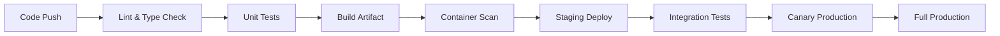

# CI/CD Pipeline

> Level: Advanced | File: `cicd-pipeline.md`
> 
> Production-grade CI/CD: fast feedback, immutable artifacts, progressive delivery, and 
> multi-environment release management.

---

## Table of Contents
1. [Core Principles](#1-core-principles)
2. [Pipeline Anatomy: Build → Test → Deploy](#2-pipeline-anatomy-build--test--deploy)
3. [CI Stage Deep Dive](#3-ci-stage-deep-dive)
4. [CD Stage Deep Dive](#4-cd-stage-deep-dive)
5. [Deployment Strategies](#5-deployment-strategies)
6. [Release Management](#6-release-management)
7. [Git Branching & Pipeline Alignment](#7-git-branching--pipeline-alignment)
8. [Tool-Specific Guides](#8-tool-specific-guides)
9. [CI/CD Anti-Patterns](#9-cicd-anti-patterns)
10. [Appendix: Templates & Checklists](#10-appendix-templates--checklists)

---

## 1. Core Principles

1. **Fast feedback** — Developer waits < 15 min for CI result
2. **Immutable artifacts** — Build once, promote across environments (never rebuild)
3. **Idempotent** — Same commit → same artifact hash → same deployment result
4. **Self-service** — Teams create pipelines via PR, not tickets
5. **Progressive delivery** — Canary → staged rollout → full deploy
6. **Observability-gated** — Deploy only if health checks pass after rollout

---

## 2. Pipeline Anatomy: Build → Test → Deploy



### Standard Pipeline Timeline

```
┌──────────────────────────────────────────────────────────────┐
│ 0m     │ Lint + Type Check + Unit Tests                      │
│ 2m     │ Build artifact (Docker image)                       │
│ 4m     │ Container vulnerability scan (Trivy)                │
│ 5m     │ Deploy to staging                                   │
│ 7m     │ Integration + E2E tests (staging)                   │
│ 10m    │ Deploy to prod canary (5%)                          │
│ 12m    │ Observe canary for 5-15 min (auto rollback)         │
│ 15m+   │ Full rollout │                                      │
└──────────────────────────────────────────────────────────────┘
```

---

## 3. CI Stage Deep Dive

### 3.1 Lint & Format — Fail Fast
```yaml
lint:
  stage: lint
  script:
    - npm run lint          # ESLint with strict rules
    - npm run format:check  # Prettier check
    - npm run typecheck     # TypeScript strict mode
  # Should complete in < 30s; if slower, split into parallel jobs
```

### 3.2 Unit Tests with Matrix
```yaml
test:
  stage: test
  strategy:
    matrix:
      node-version: [18, 20, 22]
  script:
    - npm ci
    - npm run test:coverage
    - npm run test:mutation     # Stryker (optional, slower)
  coverage: /Statements\s*:\s*(\d+(?:\.\d+)?)%/
  artifacts:
    reports:
      cobertura: coverage/cobertura-coverage.xml
```

### 3.3 Build — Immutable Artifact
```yaml
build:
  stage: build
  script:
    - npm ci
    - npm run build
    # Generate SBOM
    - syft packages . -o spdx-json > sbom.json
    # Build Docker image (multi-stage)
    - docker build \
        --build-arg BUILDKIT_INLINE_CACHE=1 \
        -t $REGISTRY/$IMAGE_NAME:$CI_COMMIT_SHA \
        -t $REGISTRY/$IMAGE_NAME:latest \
        .
    - docker push $REGISTRY/$IMAGE_NAME:$CI_COMMIT_SHA
  artifacts:
    paths:
      - sbom.json
      - dist/              # Non-Docker builds
  # Tag → also publish semver tag
  only:
    - main
    - tags
```

### 3.4 Security Scanning — Gate
```yaml
security-scan:
  stage: security
  script:
    # Dependency scan
    - npm audit --audit-level=high
    # Container scan (Trivy)
    - trivy image --severity CRITICAL,HIGH --exit-code 1 \
        $REGISTRY/$IMAGE_NAME:$CI_COMMIT_SHA
    # SAST (Semgrep)
    - semgrep --config=auto --error .
  allow_failure: false   # Gate: fail pipeline on critical findings
```

---

## 4. CD Stage Deep Dive

### 4.1 Staging Deploy — Validation Gate
```yaml
deploy-staging:
  stage: deploy
  environment:
    name: staging
    url: https://staging.example.com
  script:
    # Rolling update to staging
    - kubectl set image deployment/app \
        app=$REGISTRY/$IMAGE_NAME:$CI_COMMIT_SHA -n staging
    # Wait for rollout
    - kubectl rollout status deployment/app -n staging --timeout=5m
    # Run smoke tests
    - npm run test:smoke -- --base-url=https://staging.example.com
  environment:
    on_stop: stop-staging  # Optional: tear down staging after testing
```

### 4.2 Production Canary — Progressive Delivery
```yaml
deploy-canary:
  stage: deploy
  environment:
    name: production/canary
  script:
    - |
      # Deploy 5% canary
      kubectl patch deployment/app -n production \
        --patch '{
          "spec": {
            "template": {
              "spec": {
                "containers": [{
                  "name": "app",
                  "image": "'$REGISTRY/$IMAGE_NAME:$CI_COMMIT_SHA'"
                }]
              }
            }
          }
        }'
      # Scale canary to 5% traffic
      kubectl scale deployment/app-canary --replicas=1 -n production
    # Auto-observe for 10 minutes
    - sleep 600
    # Check error rate
    - |
      ERROR_RATE=$(curl -s "http://prometheus:9090/api/v1/query" \
        --data-urlencode \
        "query=rate(http_requests_total{app='app',version='$CI_COMMIT_SHA',status=~'5..'}[1m])" \
        | jq '.data.result[0].value[1]')
      if (( $(echo "$ERROR_RATE > 0.001" | bc -l) )); then
        echo "Error rate $ERROR_RATE exceeds threshold, rolling back"
        exit 1
      fi
```

### 4.3 Production Full Rollout
```yaml
deploy-production:
  stage: deploy
  needs: [deploy-canary, canary-observe]
  environment:
    name: production
    url: https://example.com
  script:
    # Full rollout
    - kubectl set image deployment/app \
        app=$REGISTRY/$IMAGE_NAME:$CI_COMMIT_SHA -n production
    - kubectl rollout status deployment/app -n production --timeout=10m
    # Health check
    - curl -f --retry 10 --retry-delay 3 \
        https://example.com/health
```

### 4.4 Rollback — One Command
```yaml
# Rollback action (manual trigger)
rollback:
  stage: deploy
  when: manual
  script:
    - kubectl rollout undo deployment/app -n production
    - kubectl rollout status deployment/app -n production --timeout=5m
    - curl -f https://example.com/health
```

---

## 5. Deployment Strategies

| Strategy | Downtime | Rollback Speed | Risk | Best For |
|----------|----------|----------------|------|----------|
| **Rolling Update** | Zero | Medium (per-pod) | Low | Stateless services |
| **Blue-Green** | Zero | Instant (LB switch) | Medium | Stateful + stateless |
| **Canary** | Zero | Fast (scale down) | Low | Risk-sensitive prod |
| **A/B Testing** | Zero | N/A | Low | Feature experiment |
| **Recreate** | High | Fast | High | DB migration / breaking changes |

### Canary vs Blue-Green Decision Tree
```
Need zero downtime?
├── Yes → Need fast rollback?
│   ├── Yes → Blue-Green (keep old stack idle)
│   └── No → Rolling Update (simpler ops)
└── No → Canary (gradual risk control)
    └── Need traffic shifting?
        ├── Yes → Canary with weighted service mesh
        └── No → Rolling Update
```

### Blue-Green Implementation (Kubernetes)
```yaml
# Blue environment (current production)
apiVersion: v1
kind: Service
metadata:
  name: app
  annotations:
    service.beta.kubernetes.io/aws-load-balancer-type: "nlb"
spec:
  selector:
    app: app
    deployment: blue
---
# Switch to Green: update Service selector
# kubectl patch service app -p '{"spec":{"selector":{"deployment":"green"}}}'
# Old blue pods stay alive for 5 min (connection draining)
# Rollback: repatch selector to blue
```

---

## 6. Release Management

### 6.1 Semantic Versioning
```
v1.2.3-beta.1
↑ ↑ ↑   ↑
│ │ │   └── Pre-release tag (optional)
│ │ └────── Patch (bug fix, backward-compatible)
│ └──────── Minor (new feature, backward-compatible)
└────────── Major (breaking change)
```

### 6.2 Release Automation
```yaml
# .releaserc.json (semantic-release config)
{
  "branches": ["main"],
  "plugins": [
    ["@semantic-release/commit-analyzer", {
      "preset": "conventionalcommits"
    }],
    ["@semantic-release/release-notes-generator"],
    ["@semantic-release/changelog"],
    ["@semantic-release/npm"],
    ["@semantic-release/git", {
      "assets": ["package.json", "CHANGELOG.md"]
    }],
    ["@semantic-release/github"]
  ]
}
```

### 6.3 Changelog Convention
```markdown
# Changelog — v2.5.0 (2026-05-02)

## 🚀 Features
- Add webhook replay capability (#342)
- Add batch order processing endpoint (#338)

## 🐛 Bug Fixes
- Fix timeout when processing >1000 items (#335)
- Fix memory leak in long-running connections (#331)

## 🔧 Maintenance
- Upgrade PostgreSQL driver to v5 (#340)
- Add integration tests for payment flow (#329)

## ⚠️ Breaking Changes
- Remove deprecated v1 API endpoints (migration guide: docs/migration-v2.md)
```

---

## 7. Git Branching & Pipeline Alignment

### 7.1 Trunk-Based Development (Recommended)
```
main ─────[PR merge]────[PR merge]────[PR merge]── v2.5.0 (tag)
         /                /                /
feature/a────[PR]  feature/b────[PR]  hotfix/c──[PR]
```

**Pipeline mapping:**
| Branch | CI Runs | Auto-Deploy |
|--------|---------|-------------|
| `main` | Full pipeline | To staging (automatic) |
| PR branch | Lint + Unit + Build | No deploy |
| `v*` tag | Full pipeline | To prod (with canary) |
| `hotfix/*` | Full pipeline | To staging then manual prod |

### 7.2 Version Branches
```
v2.x ──── [cherry-pick] ──── v2.4.1 (patch release)
main ──── [feature] ──────── v2.5.0
```

---

## 8. Tool-Specific Guides

### 8.1 GitHub Actions — Production Pipeline
```yaml
name: Build, Test & Deploy

on:
  push:
    branches: [main]
    tags: ['v*']
  pull_request:
    branches: [main]

env:
  REGISTRY: ghcr.io
  IMAGE_NAME: ${{ github.repository }}

jobs:
  lint-and-test:
    runs-on: ubuntu-latest
    steps:
      - uses: actions/checkout@v4
      - uses: actions/setup-node@v4
        with:
          node-version: 20
          cache: npm
      - run: npm ci
      - run: npm run lint
      - run: npm run typecheck
      - run: npm run test:coverage
      - uses: codecov/codecov-action@v3

  build-and-scan:
    needs: lint-and-test
    runs-on: ubuntu-latest
    if: github.ref == 'refs/heads/main'
    steps:
      - uses: actions/checkout@v4
      - run: docker build -t ${{ env.REGISTRY }}/${{ env.IMAGE_NAME }}:${{ github.sha }} .
      - run: trivy image --severity CRITICAL,HIGH --exit-code 1 ${{ env.REGISTRY }}/${{ env.IMAGE_NAME }}:${{ github.sha }}
      - run: docker push ${{ env.REGISTRY }}/${{ env.IMAGE_NAME }}:${{ github.sha }}
      - uses: docker/login-action@v3
        with:
          registry: ${{ env.REGISTRY }}
          username: ${{ github.actor }}
          password: ${{ secrets.GITHUB_TOKEN }}

  deploy-staging:
    needs: build-and-scan
    environment:
      name: staging
      url: https://staging.example.com
    steps:
      - run: kubectl set image deployment/app app=${{ env.REGISTRY }}/${{ env.IMAGE_NAME }}:${{ github.sha }} -n staging
      - run: kubectl rollout status deployment/app -n staging --timeout=5m

  deploy-production:
    needs: deploy-staging
    if: startsWith(github.ref, 'refs/tags/v')
    environment:
      name: production
      url: https://example.com
    steps:
      # Canary (5%) 
      - run: kubectl patch deployment/app -n production --patch '...'
      # Wait & observe
      - run: sleep 300
      # Full rollout
      - run: kubectl set image deployment/app app=${{ env.REGISTRY }}/${{ env.IMAGE_NAME }}:${{ github.sha }} -n production
      - run: kubectl rollout status deployment/app -n production --timeout=10m
```

### 8.2 GitLab CI — Monorepo Pipeline
```yaml
stages:
  - lint
  - test
  - build
  - security
  - deploy:staging
  - deploy:prod

# Monorepo: only run changed packages
workflow:
  rules:
    - if: $CI_PIPELINE_SOURCE == "merge_request_event"
    - if: $CI_COMMIT_BRANCH == "main"

.includes:
  - local: .gitlab/ci/frontend.yml
    rules:
      - changes: [ "frontend/**/*" ]
  - local: .gitlab/ci/backend.yml
    rules:
      - changes: [ "backend/**/*" ]

# Cache per package
cache:
  key: $CI_COMMIT_REF_SLUG-$CI_PROJECT_DIR
  paths:
    - node_modules/
    - .npm/
```

### 8.3 ArgoCD — GitOps Deployment
```yaml
apiVersion: argoproj.io/v1alpha1
kind: Application
metadata:
  name: myapp
  namespace: argocd
spec:
  project: default
  source:
    repoURL: https://github.com/org/k8s-manifests.git
    targetRevision: main
    path: apps/myapp/overlays/production
  destination:
    server: https://kubernetes.default.svc
    namespace: production
  syncPolicy:
    automated:
      prune: true
      selfHeal: true
    syncOptions:
      - CreateNamespace=true
      - PruneLast=true  # Prune old resources after new ones are healthy
```

---

## 9. CI/CD Anti-Patterns

### ❌ Anti-Pattern 1: Building Twice
```
BAD:  CI on commit → build → push → CD on tag → rebuild → deploy
GOOD: CI on commit → build → tag → CD on tag → promote → deploy
```

### ❌ Anti-Pattern 2: Slow Feedback
```
BAD:  CI takes 45 minutes (developer context switches 3x)
GOOD: CI under 15 minutes; if longer → split into parallel stages
```

### ❌ Anti-Pattern 3: Skip Staging
```
BAD:  PR merged → directly to prod (no staging validation)
GOOD: PR → staging tests → canary → full prod
```

### ❌ Anti-Pattern 4: Flaky Tests Without a Process
```
BAD:  "Test is flaky, let me retry the pipeline"
GOOD: "Test is flaky — quarantine it, create a ticket, fix before next release"
```

### ❌ Anti-Pattern 5: Manual Steps in Release
```
BAD:  "Let me check if the config is correct... now run the script... oh wait..."
GOOD: Everything is automated. One click deploy. Rollback in one command.
```

### ❌ Anti-Pattern 6: No Rollback Plan
```
BAD:  "We'll figure it out if something goes wrong"
GOOD: Rollback script exists, tested, and documented before every deploy
```

---

## 10. Appendix: Templates & Checklists

### 10.1 CI/CD Readiness Checklist
```
□ Linting runs in < 30s
□ Unit tests complete in < 5 min
□ Full pipeline completes in < 15 min
□ Artifact is built exactly once per commit
□ Container scanning enforces severity gate (CRITICAL/HIGH)
□ Staging tests include smoke, integration, and E2E
□ Production deploy uses canary (5%) before full rollout
□ Rollback procedure documented and tested
□ Deploy notifications sent to team channel
□ Pipeline failure alerts configured
□ Secrets are not exposed in logs or CI output
□ SBOM generated and attached to release
```

### 10.2 Incident Pipeline — Hotfix Process
```yaml
# Hotfix: bypass canary for urgent fixes
hotfix-pipeline:
  stage: hotfix
  rules:
    - if: $CI_COMMIT_BRANCH =~ /^hotfix\//
  script:
    - npm ci && npm run build
    - docker build && docker push
    # Bypass staging
    - kubectl set image deployment/app app=$IMAGE -n production
    - kubectl rollout status deployment/app -n production --timeout=5m
    # Run quick health check
    - curl -f https://example.com/health
  environment:
    name: production
```

### 10.3 Pipeline Performance Tuning
```
Slow stage?   → Parallelize (matrix, split test files)
                   or optimize (caching, skip if no changes)
Flaky test?   → Quarantine, create bug ticket
Large artifact? → Multi-stage Docker, .dockerignore, slim base image
Slow deploy?  → Pre-warm nodes, use canary (small batch first)
```

### 10.4 Branch Naming Convention
```
feature/order-batch-processing
bugfix/fix-offset-pagination
hotfix/fix-login-timeout
chore/upgrade-deps-2026-q2
release/v2.5.0-rc.1
```

### 10.5 Commit Message Convention (Conventional Commits)
```
feat: add batch order processing endpoint
                    │            └── Description (imperative, lowercase)
                    └── Type: feat/fix/docs/chore/refactor/test/ci

feat(api): add batch order endpoint
     └── Scope (optional): which component changed

BREAKING CHANGE: remove deprecated v1 API endpoints
     └── Breaking change indicator (in body or footer)
```

**Full example:**
```
feat(orders): add batch processing endpoint

Implement POST /api/v1/orders/batch that accepts up to 100 orders
in a single request. Uses background job for processing.

Closes: #342
BREAKING CHANGE: The /api/v1/orders endpoint now returns paginated
results by default. Use `?paginate=false` for the old behavior.
```
