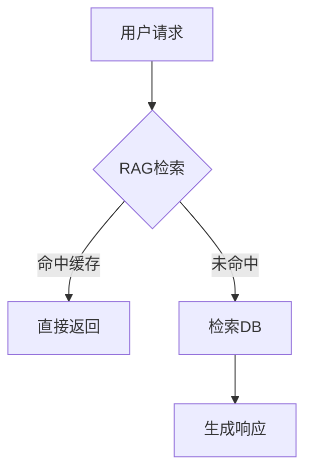

# 技术博客写作

技术文章撰写、代码示例与发布分发全流程指南。

## 技术文章结构模板

### 标准模板
```markdown
---
title: 
description: 
date: 
author: 
tags: [tech, tutorial, architecture]
---

## 背景

_为什么这个问题值得讨论？_

## 核心思路

_解决这个问题的核心思路是什么？_

## 实现方案

_具体怎么做的？（核心内容占60%）_

## 踩坑记录

_遇到的坑与解决（最有价值的部分）_

## 总结

_学到了什么？建议下一步做什么？_
```

### 各场景模板变体
```
教程型：
1. 问题 → 2. 已有方案 → 3. 新方案 → 4. 一步步实现 → 5. 对比

经验型：
1. 背景 → 2. 挑战 → 3. 尝试→失败 → 4. 最终方案 → 5. 教训

对比型：
1. 场景 → 2. 方案A（优缺点）→ 3. 方案B（优缺点）→ 4. 选型建议

深度分析：
1. 现象 → 2. 原理 → 3. 源码解读 → 4. 性能数据 → 5. 生产建议
```

## 代码示例最佳实践

### 代码展示规范
```python
# ❌ 不完整、无注释
def calc(a, b):
    return a * b

# ✅ 完整函数，上下文清晰
def calculate_request_cost(
    tokens: int,
    model_price_per_1k: float = 0.002
) -> float:
    """
    计算LLM API请求成本
    
    Args:
        tokens: 消耗的Token数
        model_price_per_1k: 每千Token价格（默认GPT-3.5价格）
    
    Returns:
        请求成本（美元）
    """
    return (tokens / 1000) * model_price_per_1k
```

### 代码展示规则
```
1. 每条代码必须有功能
2. 不展示调试代码/print
3. 注释说明核心逻辑而非语法
4. 长代码用锚点标注关键行
5. 亮色背景，行号可交互

// 关键代码用行号标注
const result = await fetch(url);  // [!code focus]
processData(result);
```

### 交互式代码示例
````
```python
# 可运行示例（完整代码块）
import asyncio

async def main():
    print("Hello, World!")

asyncio.run(main())
```
````

## 图表/架构图集成

### 推荐工具
| 类型 | 工具 | 适用 |
|------|------|------|
| 架构图 | Excalidraw / draw.io | 系统设计 |
| 流程图 | Mermaid | 流程、时序 |
| 数据图表 | Chart.js / ECharts | 性能对比 |
| 示意图 | Figma / Illustrator | UI/UX |

### Mermaid流程图示例


### 图表示例（性能对比）
```
Response Time Comparison (P50, ms):
┌─────────────────────────────────────────────────────────────┐
│ Baseline FP16  ████████████████████████████████████  1200ms │
│ AWQ W4A16      ████████████████                        580ms │
│ GPTQ W4A16     ██████████████████                      650ms │
│ GGUF Q4_K_M    ████████████████████████                880ms │
└─────────────────────────────────────────────────────────────┘
 Speedup: AWQ 2.07x | GPTQ 1.85x | GGUF 1.36x
```

## 发布与分发策略

### 分发渠道
| 平台 | 内容形式 | 受众 | 更新频率 |
|------|----------|------|----------|
| 个人Blog | 完整文章 | 技术深度读者 | 2-4周/篇 |
| 知乎专栏 | 完整文章 | 中文技术社区 | 4-6周/篇 |
| 掘金 | 完整文章 | 前端/中英文 | 3-4周/篇 |
| Medium | 英文文章 | 国际开发者 | 4-8周/篇 |
| Twitter/X | Thread小文 | 技术圈传播 | 1周/次 |
| 微信公号 | 精简版文章 | 国内技术人 | 2-4周/篇 |

### SEO优化
```markdown
SEO Check:
- [ ] 标题含核心关键词（前60字符）
- [ ] description含关键词（≤160字符）
- [ ] H1/H2含关键词
- [ ] 内部链接 2-3个
- [ ] 外部高质量引用 1-2个
- [ ] 图片Alt文本
- [ ] Open Graph tags
- [ ] 文章结构（目录/标题层次）
```

### 发布排期建议
```
Day 1 : 撰写初稿（80%内容）
Day 2 : 代码验证 + 图表制作
Day 3 : 修改润色 + 内部Review
Day 4 : 编辑排版 + SEO优化
Day 5 : 首平台发布
Day 6 : 跨平台排期分发（间隔2-3天）
第2周: 跟踪数据（阅读/点赞/评论）
第3周: 根据反馈更新文章
```

## 写作检查清单

- [ ] 开头吸引人（问题/数据/故事）
- [ ] 核心内容充实的60%
- [ ] 代码可运行验证过
- [ ] 图表辅助理解
- [ ] 术语解释（首提时）
- [ ] 技术选型有理由
- [ ] 性能/对比有数据
- [ ] 踩坑记录最有价值
- [ ] 总结可操作
- [ ] SEO设置完成
- [ ] 跨平台适配（格式/长度）
- [ ] 评论区预计回复准备
